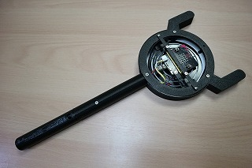

Magical Staff
=========

This is the project of a magical staff using micro:bit.

## Features

+ Controlled by micro:bit
+ 93 full colour LEDs

## Principal electronic parts list

|electronic parts|quantity|
|:-----------|------------:|
|[micro:bit](https://microbit.org/)|1|
|[yin:bit ver 1.2](https://github.com/GomiHgy/yin_bit)|1|
|[93 Bit WS2812B 5050 RGB LED Full Color Driver Board](https://www.digitspace.com/93-bit-ws2812b-5050-rgb-led-full-color-driver-board?ab160371956d1db0)|1|
|Tact switch|2|
|USB Type-A Connerctor (m)|1|
|USB Type-A Connerctor (f)|1|
|USB micro cable|1|
|[Powerbank BSMPB2618P1BK](https://www.buffalo.jp/product/detail/bsmpb2618p1bk.html)|1|

## Sorce code

+ source/microbit_MagicalStaff.py --- Illumination program

## 3D printing models

+ 3Dmodels/MagicalStaff_Main_front.stl
+ 3Dmodels/MagicalStaff_Main_back.stl
+ 3Dmodels/MagicalStaff_Horn.stl   --- Right part
+ 3Dmodels/MagicalStaff_Horn_reverse.stl   --- Left part
+ 3Dmodels/yinbit1_2_mount_top.stl
+ 3Dmodels/yinbit1_2_mount_under.stl
+ 3Dmodels/MagicalStaff_LEDSpacer.stl
+ 3Dmodels/MagicalStaff_LEDSpacer_Upper.stl
+ 3Dmodels/MagicalStaff_Stick_front.stl
+ 3Dmodels/MagicalStaff_Stick_back.stl
+ 3Dmodels/MagicalStaff_Stick_front_ReverseUSB.stl --- not used (This is to reverse USB connector)
+ 3Dmodels/MagicalStaff_Stick_back.stl --- not used (This is to reverse USB connector)

## Pictures

[Magical Staff](img/MagicalStaff.jpg)  

[taking off the battery](img/MagicalBatteryOff.jpg)  

[Back](img/MagicalBack.jpg)  

[Parts](img/Parts.jpg)  

